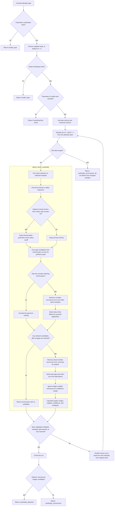

# FractoCardinality control flow

This diagram follows the production `FractoCardinality()` path. It shows the
return-gap candidate detector and the separate adaptive-horizon gate. A
candidate omitted from ranking is an insufficient-evidence outcome under the
current finite sample, not proof that the period cannot exist.

## Candidate exclusion and evidence criteria

- A parameter or supplied seed that is non-finite exits as `invalid_input`
  before orbit sampling. A point outside the main cardioid bypasses this
  detector and returns `FractoFastCalc` output. Within the main cardioid, an
  escaped sampled orbit returns `cardinality_inconclusive` with
  `detection.status: orbit_escaped`; its finite prefix is not passed to the
  return detector.
- Only local radius minima (`radius <= previous` and `radius < next`) are used
  to propose return gaps. If the
  sorted minima contain an adjacent radius ratio of at least 10, minima above
  the geometric-mean cutoff are excluded from gap formation.
- A gap is proposed only by pairs no more than 24 positions apart in the
  filtered minima sequence. A gap with fewer than the configured number of
  matching minima pairs is excluded from ranking. The default is 5; the value
  is clamped to 5–64.
- Every retained gap gets a median complex recurrence error from comparisons
  in the latter half of the sampled orbit. The lowest error ranks first; a tie
  prefers the gap with more matching minima. Radius-pyramid coherence and
  recurrence diagnostics describe the candidate and affect ambiguity and
  adaptive continuation; a pyramid sign change does not directly remove a
  candidate in this detector.
- There is no fixed maximum recurrence-error cutoff, closure-residual cutoff,
  or ambiguity cutoff that removes an otherwise retained gap. If retained
  candidates have weak evidence, the best-ranked candidate can still be
  returned with `ambiguous: true`; otherwise adaptive sampling may continue.
- Integer-multiple gaps are treated as harmonics of the winning gap when
  calculating its confidence margin. They remain visible in the alternative
  diagnostics; they are not independently counted as competing explanations
  for that margin.
- The public `ambiguous` flag is true when recurrence quality is below 0.5,
  confidence margin is below 0.1, pyramid magnitude coherence is below 0.5,
  or the least-coherent pyramid layer is below 0.5. This flag does not itself
  erase the selected candidate.
- Adaptive detection continues only if all of these are satisfied: the
  detector found an integer candidate; the horizon is at least ten times its
  period; pyramid magnitude coherence is at least 0.9; minimum-layer
  magnitude coherence is at least 0.5; recurrence quality is at least 0.9;
  confidence margin is at least 0.25; and `ambiguous` is false. Otherwise the
  horizon doubles unless adaptation is disabled, the orbit escaped, or the
  maximum horizon was reached.

At each adaptive horizon the orbit is sampled again from the original seed.
The returned candidate is therefore the detector's best-ranked finite-sample
estimate under the final checked horizon, not a mathematical proof of a
primitive period or attracting cycle. `detect_pyramid_contenders()` is a
separate diagnostic sieve and is not the candidate-selection function called
by `FractoCardinality()`.
